<h1 align="center">HUD</h1>

  A heads-up-display desktop for <b>Chimera Linux</b>:
  <a href="https://github.com/YaLTeR/niri">niri</a> +
  <a href="https://quickshell.org">Quickshell</a>, recoloured from whatever wallpaper you pick.
   
  <a href="INSTALL.md"><b>Install</b></a> ·
  <a href="#keybinds">Keybinds</a> ·
  <a href="#under-the-hood">Under the hood</a>

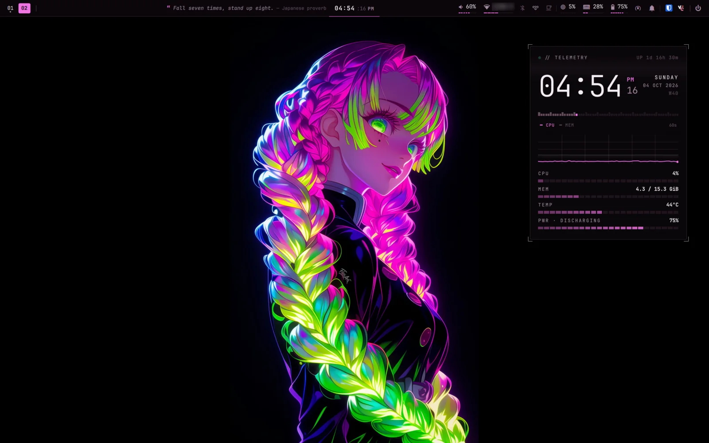

Everything on screen is one Quickshell config: the bar, the telemetry HUD, notifications,
settings, the calendar, the lock screen and an ASCII-art screensaver. It works under niri or
Hyprland, and there's no waybar, mako, swaylock or swayidle.

## Everything follows the wallpaper

Pick a wallpaper and a script pulls a palette out of it. The palette recolours the shell, niri's
focus ring, the terminal, the launcher, GTK apps, Chromium, mpv, fastfetch, htop, the prompt and
the folder icons. A mostly grey wallpaper gets a monochrome theme.

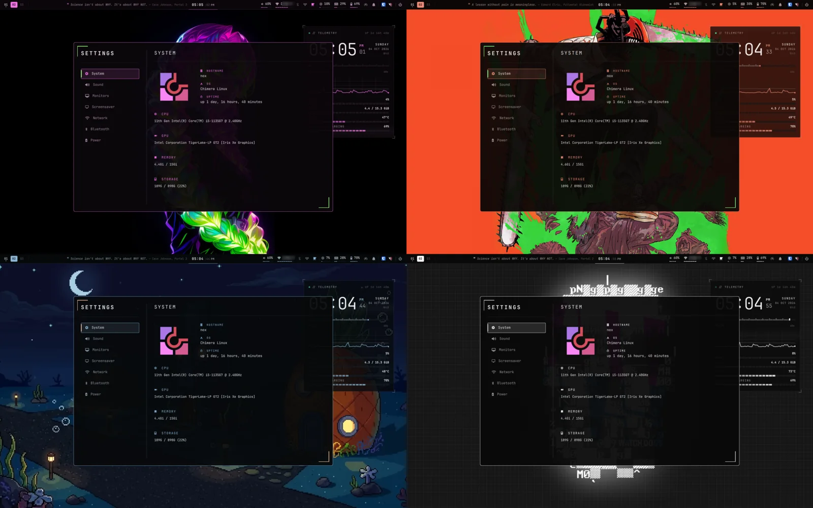

  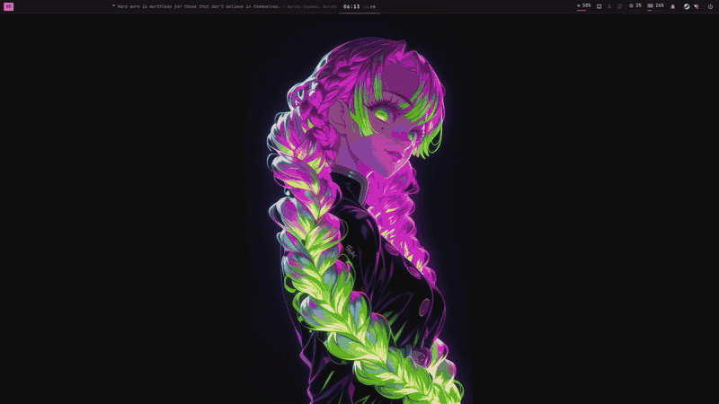
   The wallpaper picker (Mod+Shift+W): slanted slices, the current one opens into a card and
  previews behind it. Enter applies it and everything recolours.

## The bar

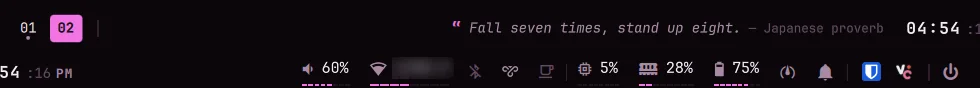

- **Left:** workspaces with a sliding indicator and the focused window's title.
- **Middle:** the clock, with the calendar one click away.
- **Right:** chips for volume, Wi-Fi, Bluetooth, Tailscale, caffeine, CPU, RAM, battery, power
  profile, notifications and the tray. Click a chip for a dropdown; right-click it for a
  shortcut.
- **The quote slot:** quotes from games, anime and hacker culture type themselves out next to the
  clock. Long ones scroll past like a news ticker.

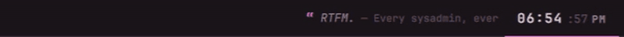

### Skits

Every few quote changes, a little skit plays instead. There are 19 of them.

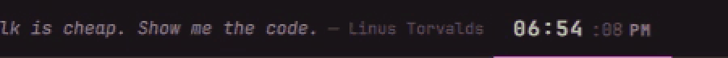

The bar also **reacts to the machine**:
- **Battery and power:** it begs for a charge at low battery, thanks you for plugging in, and
  says "POWER UP!" on the performance profile.
- **Connections:** it mourns lost internet, and puts on shades (⌐■_■) when Tailscale connects.
- **Everything else:** it waves at new Bluetooth devices, dances when a song starts, says
  cheese for screenshots, warns about calendar events, says welcome back, and tells you to go to
  bed at 3 AM.

## Telemetry HUD

The panel on the right of the desktop sits behind your windows on every workspace:
- a big clock with the date and week number
- uptime
- a 60-second CPU and memory graph
- gauges for CPU, memory, temperature and battery

Mod+H hides it.

## Settings

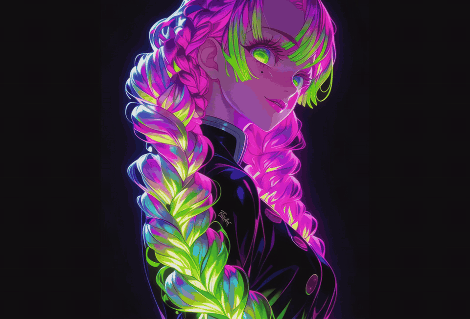

The pages are System, Sound (outputs and inputs), Monitors (brightness, night light, scale),
Screensaver, Network (Wi-Fi, wired and VPNs), Bluetooth and Power. The Power page has profiles
that switch automatically on battery, battery health, and a charge limit.

The **Screensaver** page sets when the screensaver starts, how often the scene changes, when the
screen locks and when it turns off. It can also skip the screensaver on battery, and it has a
card for each scene: click one to preview it, or use the switch on the card to take it out of
the rotation.

## Calendar

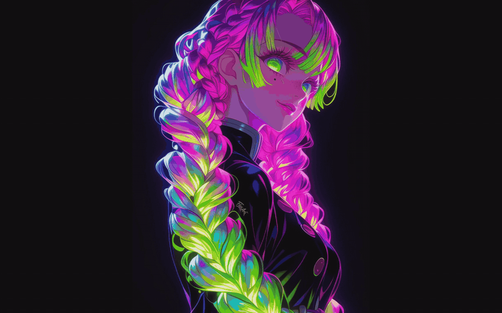

  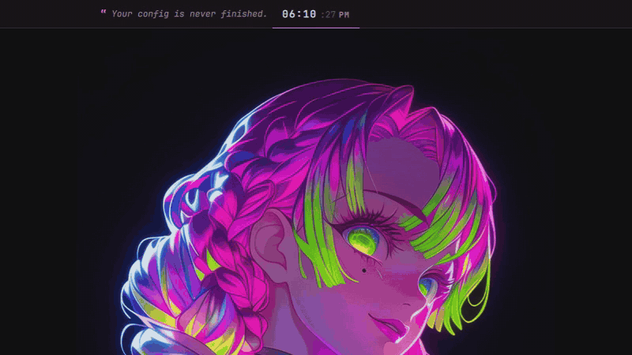
   The dropdown from the clock.

- **Views:** month, week and agenda, with event details, and a quick dropdown from the clock.
- **Events:** repeating events, multi-day events, reminders, and clickable links.
- **Storage:** events are plain `.ics` files in `~/.calendar`, so Syncthing keeps them in step
  between machines, and conflicts are handled.

## Screensaver

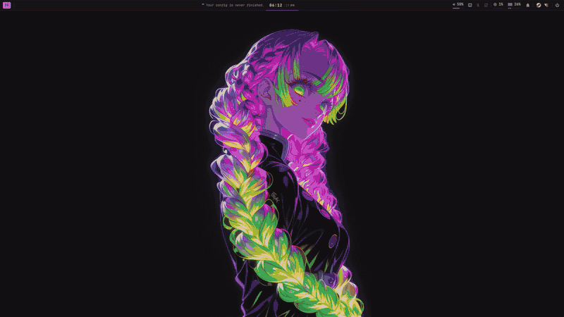

After a few idle minutes every monitor turns into animated ASCII art, each with its own scene:
- **Hand-drawn scenes:** Half-Life, your distro's logo, Naruto and Death Note.
- **Scenes made from GIFs and logos:** Nintendo 64, Hack The Box, Emacs, Vim, Factorio, the Dark
  Souls bonfire and a Half-Life headcrab.

`gif2ascii.py` turns any GIF into coloured block characters. It can remove backgrounds, including
transparent ones and checkerboards, scale pixel art without smoothing, and animate still logos.

## Lock screen

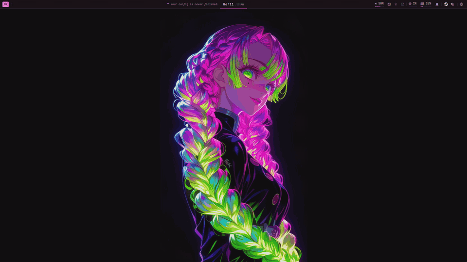

The lock screen uses PAM, shows the wallpaper blurred, a clock and a quote, and always locks
before the laptop suspends.

## And the rest

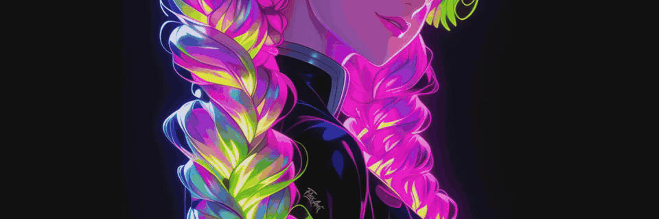

- **Power menu** (Mod+Shift+E): pick with the arrows, the mouse or a letter; log out, reboot
  and shut down ask twice.
- **Notifications:** popups plus a notification center (Mod+N), and do not disturb.
- **Volume pop-up:** appears when the volume changes.
- **Package finder** (Mod+Shift+P): fuzzy search over apk and Flathub, installed tabs,
  sub-packages and offline caches.
- **fastfetch:** a HUD tree layout with the right logo for each distro.
- **htop:** a header with live graphs, in the theme's colours.
- **Tailscale:** a bar chip and dropdown, plus a VPN section in Settings.
- **Caffeine:** keeps the machine awake.
- **Night light:** a tiny C gamma daemon with sunset scheduling.
- **Clipboard history** on Mod+V.
- **Brightness keys** with exponential steps that fade.
- **Battery charge limit.**
- **`songtag`:** identifies your music library with Shazam, through SongRec, and fixes the tags
  and cover art.

## Keybinds

| Keys | Action |
|---|---|
| Mod+Return | Terminal (alacritty) |
| Mod+D | Launcher (fuzzel) |
| Mod+Shift+D | Files (Nautilus) |
| Mod+W | Chromium |
| Mod+S | Settings |
| Mod+C | Calendar |
| Mod+N | Notification center |
| Mod+H | Telemetry HUD |
| Mod+V | Clipboard history |
| Mod+Shift+P | Package finder (apk + flatpak) |
| Mod+Shift+W | Wallpaper picker |
| Mod+Shift+L | Lock |
| Mod+Shift+E | Power menu |
| Mod+P / Mod+Ctrl+P / Mod+Alt+P | Screenshot region / screen / window |
| Mod+Shift+/ | All niri keybinds |

## Under the hood

| | |
|---|---|
| OS | Chimera Linux (Gentoo works too) |
| Compositor | niri, or Hyprland |
| Shell | Quickshell (QML), one config in `~/.config/quickshell` |
| Wallpaper | awww + `~/.config/theme/wallpaper-theme` |
| Terminal / launcher | alacritty, fuzzel |
| Font | JetBrainsMono Nerd Font |
| Dotfiles | a bare git repo whose work tree is `$HOME` |

It's driven by IPC: `qs ipc show` lists every command, for example `qs ipc call bar skit pacman`
or `qs ipc call screensaver scene n64`.

**[→ How to install it](INSTALL.md)**. The install guide also has notes for an AI agent doing the
setup.

Screenshots are from a 1920×1200 laptop. Wallpapers aren't included. The calendar events
and notifications shown are made up.
