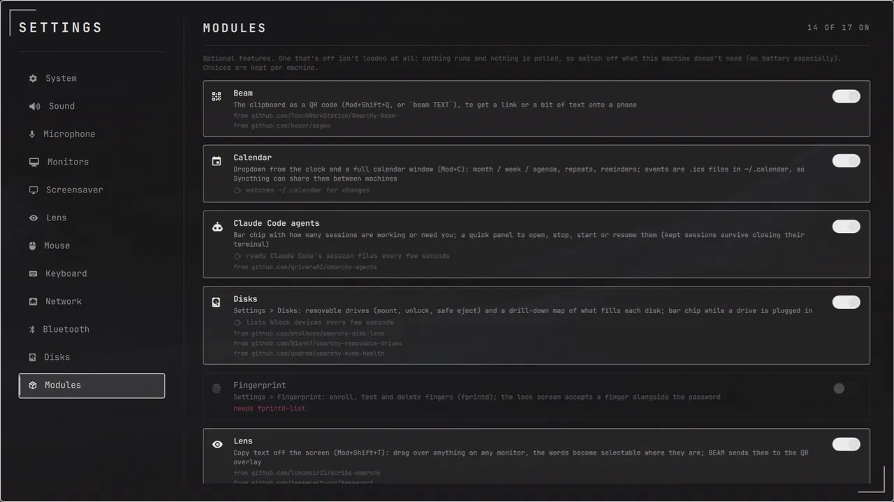
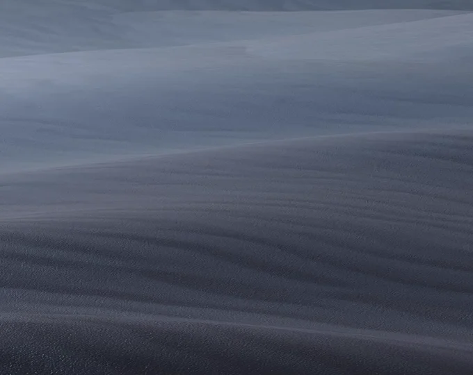
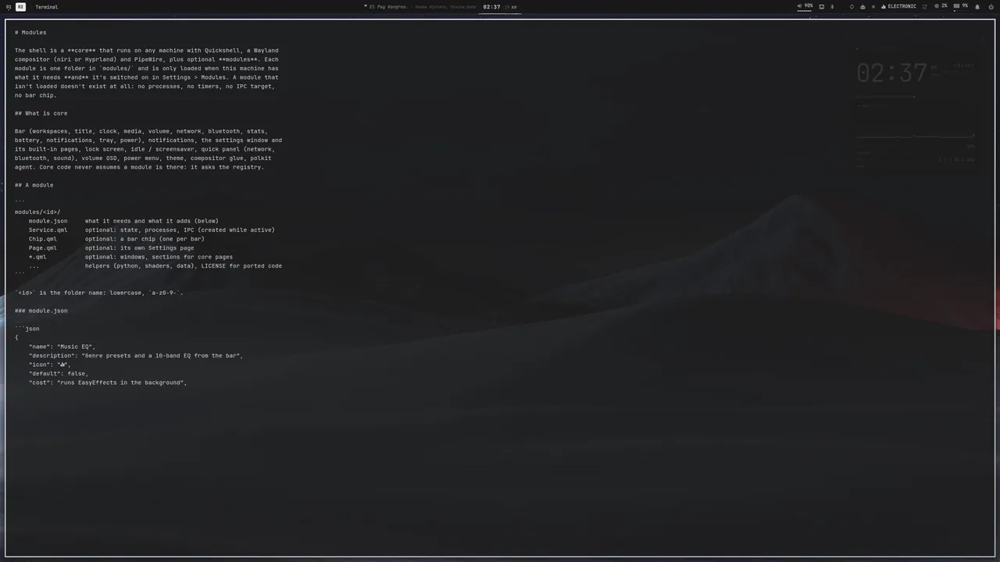
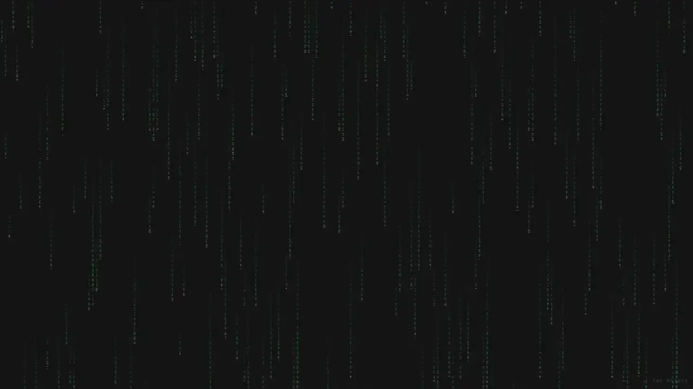

<h1 align="center">HUD</h1>

  A heads-up-display desktop for <b>Chimera Linux</b>:
  <a href="https://github.com/YaLTeR/niri">niri</a> +
  <a href="https://quickshell.org">Quickshell</a>, recoloured from whatever wallpaper you pick.
   
  <a href="INSTALL.md"><b>Install</b></a> ·
  <a href="#modules">Modules</a> ·
  <a href="#keybinds">Keybinds</a> ·
  <a href="#credits">Credits</a> ·
  <a href="#under-the-hood">Under the hood</a>

Everything on screen is one Quickshell config: the bar, the telemetry HUD, notifications,
settings, the calendar, the lock screen and an ASCII-art screensaver. It works under niri or
Hyprland, and there's no waybar, mako, swaylock or swayidle.

Many of the features started as [Omarchy](https://omarchy.org) plugins, rebuilt here to fit this
shell; every one is credited [below](#credits).

## Modules

A small core runs on any machine; everything else is a **module** you can switch off in
Settings > Modules. A module that's off isn't loaded at all: no processes, no polling, no bar
chip. A module also checks what it needs (EasyEffects, tailscale, fprintd, a battery …) and
says what's missing instead of breaking. Choices are per machine, so a laptop can run a lighter
set than a desktop from the same dotfiles.

| Module | What it does |
|---|---|
| Music EQ | bar chip that opens a 10-band EQ with 16 genre presets (EasyEffects), on top of the speaker calibration |
| Microphone | NoiseTorch noise suppression and a mic effects rack (compressor, EQ, de-esser, reverb, auto-tune …) |
| Speaker calibration | measures the speakers with a mic and plays everything through a correction filter |
| Lens | copy text off the screen (Mod+Shift+T) |
| Beam | the clipboard as a QR code (Mod+Shift+Q) |
| Disks | drill-down map of what fills each disk, removable drives (mount, unlock, safe eject), SMART health |
| Calendar | dropdown from the clock and a full calendar window |
| Claude Code agents | bar chip and quick panel for running Claude Code sessions |
| Screen recorder | bar chip and panel for `wf-recorder` |
| Tailscale, Syncthing | bar chips and panels |
| Night light, Telemetry HUD, Speed test, Typing test, Fingerprint, Phone pushes | as below |

Adding one is a folder with a `module.json`; see [`MODULES.md`](../.config/quickshell/MODULES.md).

## Everything follows the wallpaper

Pick a wallpaper and a script pulls a palette out of it. The palette recolours the shell, niri's
focus ring, the terminal, the launcher, GTK apps, Chromium, mpv, fastfetch, htop, the prompt and
the folder icons. A mostly grey wallpaper gets a monochrome theme.

  
   The wallpaper picker (Mod+Shift+W): slanted slices, the current one opens into a card and
  previews behind it. Enter applies it and everything recolours.

## The bar

- **Left:** workspaces with a sliding indicator and the focused window's title.
- **Middle:** the clock, with the calendar one click away.
- **Right:** chips for volume, Wi-Fi, Bluetooth, then whatever modules are on (Tailscale,
  Syncthing, Claude Code agents, the recorder, the EQ, a plugged-in drive), caffeine, CPU, RAM,
  battery, power profile, notifications and the tray. Click a chip for a dropdown; right-click it
  for a shortcut.
- **The quote slot:** quotes from games, anime and hacker culture type themselves out next to the
  clock. Long ones scroll past like a news ticker.

### Skits

Every few quote changes, a little skit plays instead. There are 42 of them: from Pac-Man and a
Dark Souls bonfire to a Chainsaw Man cord-pull, Gentoo compiling, a Metal Gear box, FUS RO DAH,
the Matrix rain and a TempleOS oracle. `qs ipc call bar list` names them all.

The bar also **reacts to the machine**:
- **Battery and power:** it begs for a charge at low battery, thanks you for plugging in, and
  says "POWER UP!" on the performance profile.
- **Connections:** it mourns lost internet, and puts on shades (⌐■_■) when Tailscale connects.
- **Fingerprints:** it says "it's you! welcome back" when a finger unlocks the screen, cheers a
  newly enrolled print, and reacts to tests in Settings ("identity confirmed." / "who are you?").
  `qs ipc call fingerprint event unlock` (or enrolled, match, nomatch...) plays one.
- **Everything else:** it waves at new Bluetooth devices, dances when a song starts, says
  cheese for screenshots, warns about calendar events, says welcome back, and tells you to go to
  bed at 3 AM.

## Telemetry HUD

The panel on the right of the desktop sits behind your windows on every workspace:
- a big clock with the date and week number
- uptime
- a 60-second CPU and memory graph
- gauges for CPU, memory, temperature and battery

Mod+H hides it.

## Settings

The pages are System, Sound (outputs, inputs and speaker calibration), Microphone, Monitors,
Screensaver, Lens, Mouse, Keyboard, Network (Wi-Fi, wired, VPNs and a speed test), Bluetooth,
Disks, Power, Fingerprint and Modules. The window takes 70% of the screen and scales its
contents with the monitor, so it looks the same at 1080p and 4K.

- **Monitors:** drag the monitors into place, then set resolution, refresh rate, scale and
  rotation; nothing sticks until you press KEEP. Brightness and night light (always, sunset to
  sunrise, or custom times) live here too.
- **Mouse and Keyboard:** pointer speed and acceleration, key repeat, layouts and xkb options,
  and every Hyprland shortcut can be re-recorded or switched off. The cursor is recoloured to the
  wallpaper's accent.
- **Typing test** (on the Keyboard page): timed, word-count and passage tests with live WPM,
  accuracy, consistency, a per-second chart, history and a heatmap of the keys you miss.
- **Disks:** a drill-down map of what fills each disk, removable drives, and SMART health.
- **Power:** profiles that switch automatically on battery, battery health, and a charge limit.

The **Fingerprint** page lists the ten fingers: pick one and enroll it, and the fingerprint icon
fills in with colour as the reader takes each scan (a missed scan turns the circle red for a
moment; it goes green when done). You can also test or delete prints there. Enrolled fingers
unlock the lock screen. `qs ipc call fingerprint demo` plays an enroll without the reader.

The **Screensaver** page sets when the screensaver starts, how often the scene changes, when the
screen locks and when it turns off. It can also skip the screensaver on battery, and it has a
card for each scene: click one to preview it, or use the switch on the card to take it out of
the rotation.

## Audio

- **Music EQ:** the EQ chip opens this widget in the bottom left: 16 genre presets, 10 bands
  (drag, scroll, double-click to reset), your own saved curves, and an automatic preamp so boosts
  don't clip. EasyEffects does the processing, after everything else and before the speaker
  calibration.
- **Speaker calibration** (Settings > Sound): plays sweeps, measures them with a microphone, and
  installs a correction filter as the "Calibrated Speakers" output.
- **Microphone** (Settings > Microphone): NoiseTorch's RNNoise filter removes fans and keyboards,
  then an effects rack (gate, compressor, de-esser, EQ, pitch and auto-tune with a clickable
  piano, voice effects, reverb and delays, limiter) feeds a "Microphone Effects" mic that apps
  record from. Presets for meetings, podcasts and more.

## Lens and Beam

**Lens** (Mod+Shift+T) freezes every monitor; drag over anything, even an image or a video, and
the words become selectable right where they are. Copy them, search them, or press **BEAM**.

**Beam** (Mod+Shift+Q, or `beam TEXT`) shows the clipboard as a QR code, to get a link or a bit
of text onto a phone without sending it anywhere.

## Calendar

  
   The dropdown from the clock.

- **Views:** month, week and agenda, with event details, and a quick dropdown from the clock.
- **Events:** repeating events, multi-day events, reminders, and clickable links.
- **Storage:** events are plain `.ics` files in `~/.calendar`, so Syncthing keeps them in step
  between machines, and conflicts are handled.

## Screensaver

After a few idle minutes every monitor turns into animated ASCII art, each with its own scene:
- **Hand-drawn scenes:** Half-Life, your distro's logo, Naruto, Death Note and The Matrix (the
  film's opening lines, then digital rain drawn by a shader).
- **Scenes made from GIFs and logos:** Nintendo 64, Hack The Box, Emacs, Vim, Factorio, the Dark
  Souls bonfire and a Half-Life headcrab.

`gif2ascii.py` turns any GIF into coloured block characters. It can remove backgrounds, including
transparent ones and checkerboards, scale pixel art without smoothing, and animate still logos.

## Lock screen

The lock screen uses PAM (password, or an enrolled fingerprint), shows the wallpaper blurred, a clock and a quote, and always locks
before the laptop suspends.

## And the rest

- **Power menu** (Mod+Shift+E): pick with the arrows, the mouse or a letter; log out, reboot
  and shut down ask twice.
- **Notifications:** popups plus a notification center (Mod+N), and do not disturb.
- **Volume pop-up:** appears when the volume changes.
- **Package finder** (Mod+Shift+P): fuzzy search over apk and Flathub, installed tabs,
  sub-packages and offline caches.
- **fastfetch:** a HUD tree layout with the right logo for each distro.
- **htop:** a header with live graphs, in the theme's colours.
- **Tailscale:** a bar chip and dropdown, plus a VPN section in Settings.
- **Syncthing:** a bar chip. Click opens the web UI, starting Syncthing first if needed (dinit,
  OpenRC user services, or no service manager); right-click starts or stops it.
- **Claude Code agents:** a bar chip that counts working sessions and turns red when one needs
  you; its panel opens, stops, starts or resumes them, and kept sessions survive closing their
  terminal.
- **Caffeine:** keeps the machine awake.
- **Phone pushes** through [ntfy](https://ntfy.sh): while the screen is locked or you've been
  idle for 2 minutes, notifications, low battery, the charger and Tailscale dropping go to your
  phone. A Claude Code hook does the same when Claude finishes or needs you.
- **Night light:** a tiny C gamma daemon with sunset scheduling.
- **Clipboard history** on Mod+V.
- **Screen recorder:** a bar chip and panel for `wf-recorder`: whole screen or a dragged-out area
  (no slurp needed), desktop audio or mic, a 3 s countdown, then the running time in red.
  Mod+Alt+R starts and stops, Mod+Alt+Shift+R picks an area. Files go to `~/Videos/Recordings`.
- **zathura** (PDFs): dark pages and colours from the wallpaper, live.
- **Brightness keys:** `brightglide`, a tiny C helper (`~/.local/src/brightglide`, `make install`)
  that steps in perceived lightness and glides there with easing. A held key is one continuous
  glide. The bottom-centre popup shows brightness as well as volume.
- **Battery charge limit.**
- **`songtag`:** identifies your music library with Shazam, through SongRec, and fixes the tags
  and cover art.

## Keybinds

| Keys | Action |
|---|---|
| Mod+Return | Terminal (alacritty) |
| Mod+D | Launcher (fuzzel) |
| Mod+Shift+D | Files (Nautilus) |
| Mod+W | Chromium |
| Mod+S | Settings |
| Mod+C | Calendar |
| Mod+N | Notification center |
| Mod+H | Telemetry HUD |
| Mod+V | Clipboard history |
| Mod+Shift+P | Package finder (apk + flatpak) |
| Mod+Shift+T | Lens: copy text off the screen |
| Mod+Shift+Q | Beam the clipboard as a QR code |
| Mod+Alt+R / Mod+Alt+Shift+R | Record the screen / an area |
| Mod+Shift+W | Wallpaper picker |
| Mod+Shift+L | Lock |
| Mod+Shift+E | Power menu |
| Mod+P / Mod+Ctrl+P / Mod+Alt+P | Screenshot region / screen / window |
| Mod+Shift+/ | All niri keybinds |

## Credits

These features started from other people's work. Thank you!

| Here | Based on |
|---|---|
| Lens | [lunanoir21/scribe-omarchy](https://github.com/lunanoir21/scribe-omarchy), OCR by [tesseract](https://github.com/tesseract-ocr/tesseract) |
| Beam | [TouchWorkStation/Omarchy-Beam-](https://github.com/TouchWorkStation/Omarchy-Beam-), QR codes by [segno](https://github.com/heuer/segno) (vendored, BSD) |
| Claude Code agents chip | [grivera82/omarchy-agents](https://github.com/grivera82/omarchy-agents) |
| Speaker calibration | [thefreshoffice/omarchy-speaker-calibrator](https://github.com/thefreshoffice/omarchy-speaker-calibrator) (ported to OpenRC) |
| Music EQ | [EasyEffects](https://github.com/wwmm/easyeffects) |
| Noise suppression | [NoiseTorch-ng](https://github.com/noisetorch/NoiseTorch) and [RNNoise](https://github.com/xiph/rnnoise) |
| Mic effects rack | [WhoIsCalebBrown/mic-effects](https://github.com/WhoIsCalebBrown/mic-effects) (MIT), itself from [alanfortlink/camera-effects](https://github.com/alanfortlink/camera-effects) |
| Speed test | [Davedes83/omarchy-netspeed-plugin](https://github.com/Davedes83/omarchy-netspeed-plugin), against [speed.cloudflare.com](https://speed.cloudflare.com) |
| Monitors layout editor | [FlipZ3ro/screenhub](https://github.com/FlipZ3ro/screenhub) |
| Disk map | [mtolhuys/omarchy-disk-lens](https://github.com/mtolhuys/omarchy-disk-lens) |
| Removable drives | [Wian47/omarchy-removable-drives](https://github.com/Wian47/omarchy-removable-drives) |
| Disk health | [qadram/omarchy-nvme-health](https://github.com/qadram/omarchy-nvme-health) (MIT) |
| Accent cursor | [SmoothPixels/cursor-accent](https://github.com/SmoothPixels/cursor-accent), on [Bibata](https://github.com/ful1e5/Bibata_Cursor) |
| The Matrix scene | [nzkritik/omarchy-matrix-lock](https://github.com/nzkritik/omarchy-matrix-lock) (MIT) |
| Typing test | [leomoon-studios/omarchy-typing-test](https://github.com/leomoon-studios/omarchy-typing-test) (passages CC0) |
| Phone pushes | [ntfy](https://ntfy.sh) |
| `songtag` | [SongRec](https://github.com/marin-m/SongRec) |
| The plugins' home | [Omarchy](https://omarchy.org) and its [plugin catalog](https://plugins.omarchy.org) |

## Under the hood

| | |
|---|---|
| OS | Chimera Linux (Gentoo works too) |
| Compositor | niri, or Hyprland |
| Shell | Quickshell (QML), one config in `~/.config/quickshell` |
| Wallpaper | awww + `~/.config/theme/wallpaper-theme` |
| Terminal / launcher | alacritty, fuzzel |
| Font | JetBrainsMono Nerd Font |
| Dotfiles | a bare git repo whose work tree is `$HOME` |

It's driven by IPC: `qs ipc show` lists every command, for example `qs ipc call bar skit pacman`
or `qs ipc call screensaver scene n64`.

**[→ How to install it](INSTALL.md)**. The install guide also has notes for an AI agent doing the
setup.

Most screenshots are from a 1920×1200 laptop; the Modules, Audio, Lens, Beam and Matrix
clips are from a 2560×1440 desktop. Wallpapers aren't included. The calendar events and
notifications shown are made up.
